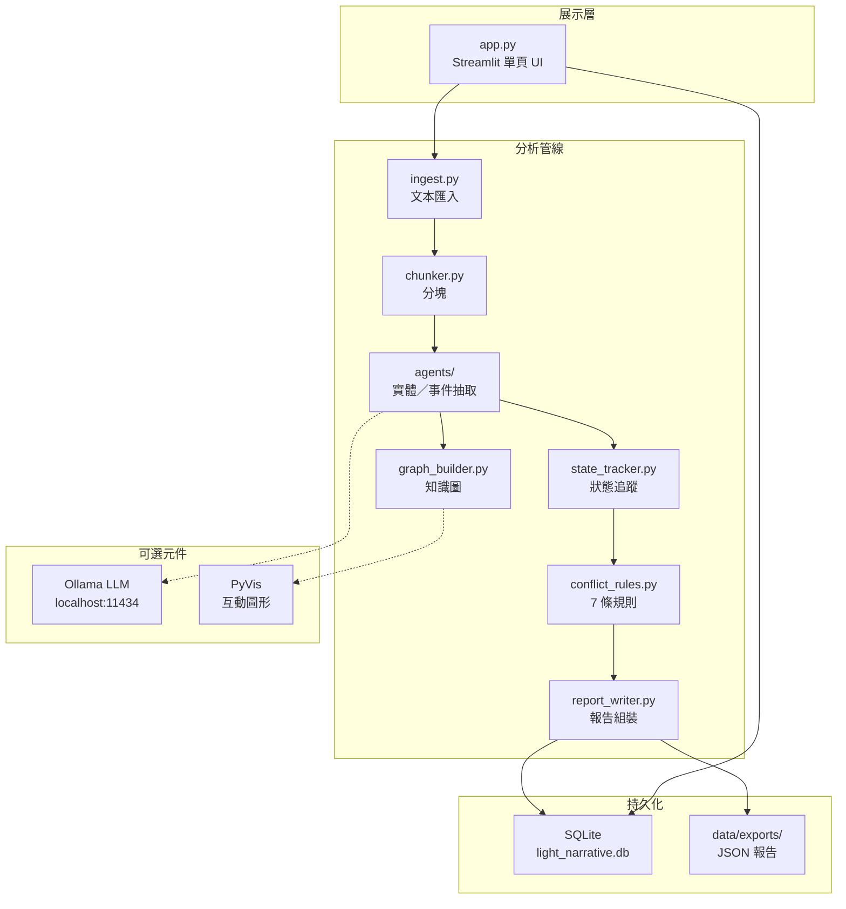
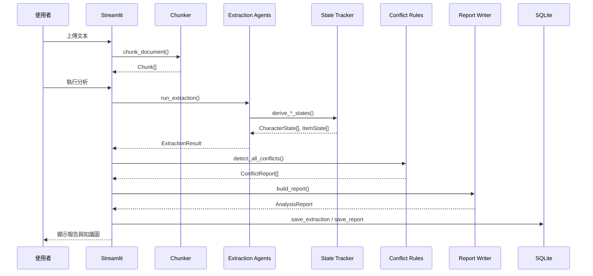

# 輕量智敘（Light Narrative）技術報告

**版本：** 期末 MVP（2026-06 交付版）  
**文件性質：** 系統設計、實作說明與驗收紀錄  
**最後驗證：** `python -m pytest tests/ -q` → 30 passed

---

## 1. 摘要

輕量智敘是一套**本地優先**的中文敘事一致性檢查工具，協助作者在小說、劇本與原創 IP 文本中偵測敘事矛盾——例如角色死亡後仍活動、唯一物品矛盾、世界規則違反、人設漂移與設定反轉。

本系統**不是**自動寫作或自動修稿工具。其核心價值在於：

- 以 **7 條確定性（deterministic）衝突規則** 產出可重現、可測試的檢查結果
- 以 **Heuristic 抽取為主**，可選 **Ollama LLM** 輔助實體／事件抽取
- 以 **Streamlit 單頁 UI** 提供上傳、分析、知識圖與 JSON 報告匯出
- 以 **SQLite** 在本機持久化專案資料

衝突判斷**不由 LLM 決定**，確保結果穩定、適合期末展示與單元測試驗收。

---

## 2. 專案背景與目標

### 2.1 問題陳述

長篇敘事創作中，作者常面臨：

- 角色狀態前後不一致（死亡後仍說話、行動）
- 世界規則與後續事件矛盾（「亡者不能復活」卻出現復活）
- 唯一物品設定被違反（「僅有一把鑰匙」卻出現備用品）
- 人設與行為不符（膽小角色突然展現高能力）
- 早期世界設定與後期敘述反轉卻無伏筆鋪陳

人工逐章比對耗時且易漏。本專題目標是建立一個**可本地執行、規則可解釋**的 MVP，輔助作者發現問題並提供 `suggested_fix` 文字建議。

### 2.2 設計原則

| 原則 | 說明 |
|------|------|
| 本地優先 | 資料存於本機 SQLite，無需雲端帳號 |
| 規則驅動 | 衝突偵測由 `conflict_rules.py` 決定，非黑箱 LLM |
| LLM 可選 | Ollama 僅用於抽取層；未連線自動 fallback |
| 可測試 | 每條規則皆有對應 pytest；另有 evaluation 模組 |
| 誠實邊界 | 未實作功能明確列於 `LIMITATIONS.md` |

### 2.3 非目標（刻意不在本期範圍）

- FastAPI 後端、登入、雲端協作
- HuggingFace 本地推理（目前為 stub）
- 獨立時間線引擎與視圖
- 自動修稿（僅輸出建議文字）

---

## 3. 系統架構

### 3.1 整體架構圖



### 3.2 分層職責

| 層級 | 模組 | 職責 |
|------|------|------|
| 展示層 | `app.py` | 專案管理、上傳、分析觸發、衝突報告、知識圖、JSON 匯出 |
| 匯入層 | `ingest.py` | 解析 `.txt` / `.md` / `.docx` 為 `Document` |
| 分塊層 | `chunker.py` | auto / chapter / scene / fixed 四種策略 |
| 抽取層 | `agents/entity_agent.py`, `event_agent.py` | Heuristic 或 Ollama 抽取 |
| 狀態層 | `state_tracker.py` | 角色死亡／活動、物品持有人追蹤 |
| 規則層 | `conflict_rules.py`, `narrative_patterns.py` | 確定性衝突偵測與證據過濾 |
| 輸出層 | `report_writer.py`, `graph_builder.py` | 結構化報告與 NetworkX 圖 |
| 儲存層 | `storage.py` | SQLite CRUD 與 JSON 匯出 |
| 評估層 | `evaluation/` | 離線 ground truth 比對（不影響主系統） |

### 3.3 Agent 編排

完整分析流程由 `src/agents/report_agent.py` 的 `generate_full_report()` 編排：

```text
chunks
  → run_extraction()        # 逐 chunk 抽取 + merge
  → derive_character_states() / derive_item_states()
  → run_conflict_detection()  # detect_all_conflicts()
  → build_report()
  → save_extraction() / save_report()
```

---

## 4. 技術棧

| 類別 | 技術 | 版本需求 | 用途 |
|------|------|----------|------|
| 語言 | Python 3 | — | 全系統 |
| Web UI | Streamlit | ≥ 1.32 | 單頁應用 |
| 資料驗證 | Pydantic | ≥ 2.6 | Schema 定義 |
| 圖論 | NetworkX | ≥ 3.2 | 知識圖建構 |
| 視覺化 | PyVis | ≥ 0.3.2 | 互動圖（可選 fallback） |
| 文件解析 | python-docx | ≥ 1.1 | `.docx` 上傳 |
| HTTP | httpx | ≥ 0.27 | Ollama API 呼叫 |
| 儲存 | SQLite | 內建 | 本地持久化 |
| 測試 | pytest | ≥ 8.0 | 單元與整合測試 |
| LLM（可選） | Ollama | — | llama3.2 等本地模型 |

---

## 5. 核心模組說明

### 5.1 文本匯入（`ingest.py`）

- 支援 `.txt`、`.md`、`.docx`
- 上傳後整份文本寫入 `documents.raw_text`
- Streamlit 預設上傳上限 200 MB（未自訂 `.streamlit/config.toml`）

### 5.2 分塊（`chunker.py`）

| 策略 | 行為 |
|------|------|
| **auto** | 先依「第 X 章」切章；章內有 `---` / `***` 等場景符再切；超長段 fallback |
| **chapter** | 僅依章節標題；無標題則整篇一塊 |
| **scene** | 依場景分隔符；無分隔符 fallback 為 fixed |
| **fixed** | 依段落累積，每塊上限 `DEFAULT_CHUNK_MAX_CHARS = 2500` |

`Chunk` 模型含 `chapter_index`、`chapter_title`、`kind`（chapter / scene / chunk），供狀態追蹤與證據定位。

### 5.3 抽取層（`agents/`）

**Heuristic 模式（預設）：**

- `entity_agent.py`：regex／關鍵字抽取角色、地點、物品、世界規則
- `event_agent.py`：動作句型抽取事件（每 chunk 最多 40 筆）
- `narrative_patterns.py`：中文敘事句型、否定句、實體名稱驗證

**Ollama 模式（可選）：**

- 每 chunk 送前 **3000 字**給 LLM（entity + event 各 1 次請求）
- 單次 timeout **120 秒**
- `is_available()` 失敗時自動 fallback，不中斷流程

**重要：** LLM 只影響抽取品質，**不參與衝突判斷**。

### 5.4 狀態追蹤（`state_tracker.py`）

- `derive_character_states()`：依死亡句型、觀察者句型、復活句型追蹤角色狀態
- `derive_item_states()`：追蹤物品持有人與位置變化
- 含代詞回溯（`_resolve_antecedent`）、地名誤判過濾、證據有效性檢查

### 5.5 衝突規則（`conflict_rules.py`）

`detect_all_conflicts()` 依序執行 7 條規則（含 1 條額外子規則），最後去重合併並依嚴重度排序：

| 規則 | 函式 | 衝突類型 | 偵測內容 |
|------|------|----------|----------|
| Rule 1 | `rule1_dead_then_active` | `character_state_conflict` | 角色死亡／安葬後仍活動 |
| Rule 2 | `rule2_dead_cannot_resurrect` | `world_rule_violation` | 「亡者不能復活」vs 復活事件 |
| Rule 3 | `rule3_unique_item` | `unique_item_conflict` | 唯一物品規則 vs 備用品／複數描述 |
| Rule 4 | `rule4_item_location_holder` | `item_location_conflict` | 物品持有人不一致 |
| Rule 5 | `rule5_night_bell` | `world_rule_violation` | 夜晚敲鐘規則 vs 夜間敲鐘事件 |
| Rule 8 | `rule8_voice_prohibition` | `world_rule_violation` | 發聲禁令 vs 違規發聲（霧城文本專用子規則） |
| Rule 6 | `rule6_character_drift` | `character_consistency_drift` | 人設限制 vs 高能力行為 |
| Rule 7 | `rule7_world_setting` | `world_setting_conflict` | 早期世界設定 vs 後期反轉 |

每條規則產出 `ConflictReport`，含：

- `conflict_type`、`severity`、`title`、`description`
- `evidence_a` / `evidence_b`（原文證據句）
- `related_entities`、`suggested_fix`

### 5.6 知識圖（`graph_builder.py`）

- 以 NetworkX `MultiDiGraph` 建構實體關係
- PyVis 產生互動 HTML；失敗時顯示統計與 fallback 提示
- 節點類型：角色、地點、物品、事件、規則

### 5.7 儲存（`storage.py`）

SQLite 資料表：

| 資料表 | 內容 |
|--------|------|
| `projects` | 專案名稱、描述、建立時間 |
| `documents` | 上傳檔名、原始文本 |
| `chunks` | 分塊文本與 metadata |
| `extractions` | 抽取結果 JSON |
| `reports` | 分析報告 JSON |

JSON 匯出路徑：`data/exports/report_{project_id前8字}.json`

---

## 6. 資料模型

核心 schema 定義於 `src/schemas.py`（Pydantic v2）：

```text
Project → Document → Chunk[]
                ↓
         ExtractionResult
           ├── characters[]
           ├── locations[]
           ├── objects[]
           ├── events[]
           ├── world_rules[]
           ├── character_states[]
           └── item_states[]
                ↓
         ConflictReport[]
                ↓
         AnalysisReport
```

`ConflictReport` 為對外展示與 JSON 匯出的核心結構；`AnalysisReport` 聚合統計（chunk 數、衝突數、抽取摘要）。

---

## 7. 處理流程

### 7.1 使用者操作流程

```text
1. 側欄建立／選擇專案
2. 上傳 .txt / .md / .docx，選擇分塊策略
3. 預覽分塊 → 執行敘事分析
4. 檢視抽取統計、衝突報告、知識圖
5. 匯出 JSON 至 data/exports/
```

### 7.2 系統內部管線



---

## 8. 效能與容量建議

本 MVP **非**為整本長篇小說設計。實測與展示主要使用 `samples/` 短篇（約 300～400 字、3～5 chunk）。

| 面向 | 限制／建議 |
|------|------------|
| 上傳 | Streamlit 預設 200 MB；整份讀入記憶體 |
| 分塊 | 無 chunk 數量上限；文本越長分析越慢（大致線性） |
| Heuristic | 每 chunk 依序 regex；事件每 chunk ≤ 40 筆 |
| Ollama | chunk 數 × 2 次 API；單次 120s timeout |
| 建議用量 | 展示：300～400 字；開發測試：500 字～2 萬字 |
| 不建議 | 十萬字以上整本小說一次分析 |

---

## 9. 測試與驗收

### 9.1 單元測試（pytest）

目前 **30 個測試全數通過**，涵蓋：

| 測試檔 | 驗證重點 |
|--------|----------|
| `test_character_state_conflict.py` | Rule 1：死亡後活動 |
| `test_rule2_resurrection_violation.py` | Rule 2：復活違規 |
| `test_unique_item_conflict.py` | Rule 3：唯一物品 |
| `test_rule4_item_holder_conflict.py` | Rule 4：持有人矛盾 |
| `test_world_rule_violation.py` | Rule 5：夜間敲鐘 |
| `test_character_drift.py` | Rule 6：人設漂移 |
| `test_world_setting_conflict.py` | Rule 7：設定反轉 |
| `test_no_false_positive_clean_story.py` | 無矛盾文本零誤報 |
| `test_renamed_story_generalization.py` | 換名文本泛化 |
| `test_chunker.py` | 分塊策略 |
| `test_narrative_patterns.py` | 句型與實體過濾 |
| `test_storage.py` | SQLite CRUD |
| `test_smoke_modules.py` | ingest / graph / report smoke |
| `test_evaluate_report.py` | 評估模組 |
| `test_round3_fixes.py` | 迭代修正回歸 |

驗收指令：

```bash
pip install -r requirements.txt
python -m pytest tests/ -q
streamlit run app.py
```

### 9.2 評估模組（`evaluation/`）

離線比對系統 JSON 報告與人工 ground truth，計算 TP / FP / FN、Precision、Recall、F1、Duplicate Rate、Evidence Accuracy。

**測試文本與初步結果：**

| 文本 | 預期 | 輸出 | TP | FP | FN | Precision | Recall | F1 |
|------|-----:|-----:|---:|---:|---:|----------:|-------:|---:|
| fog_bell（霧城之鐘） | 6 | 6 | 6 | 0 | 0 | 1.0 | 1.0 | 1.0 |
| clean_story（無矛盾） | 0 | 0 | 0 | 0 | 0 | — | — | — |
| renamed_story（換名） | 5 | 7 | 5 | 2 | 0 | 0.714 | 1.0 | 0.833 |
| salt_city_max_load | 10 | 10 | 10 | 0 | 0 | 1.0 | 1.0 | 1.0 |

評估執行範例：

```bash
python evaluation/generate_demo_reports.py
python evaluation/evaluate_report.py \
  --report data/exports/report_fog_bell_story.json \
  --ground-truth evaluation/ground_truth/fog_bell_gt.json \
  --out evaluation/results/fog_bell_eval.json \
  --summary evaluation/results/fog_bell_summary.md
```

---

## 10. 已知限制與風險

### 10.1 技術限制

- Heuristic 抽取對複雜中文代詞、長句仍可能誤抽
- 無獨立時間線引擎，僅有部分狀態先後規則
- 規則覆蓋僅 7 條，無法涵蓋所有敘事矛盾類型
- HuggingFace provider 為 stub，尚未實作
- 部分模組測試為 smoke level，非完整行為覆蓋

### 10.2 展示風險與備案

| 風險 | 備案 |
|------|------|
| Streamlit 啟動失敗 | 先跑 pytest；展示已匯出 JSON |
| Ollama 未安裝 | 維持 heuristic 預設 |
| PyVis 渲染失敗 | 展示 JSON stats + fallback |
| 某文本誤報 | 改用 `sample_clean_story.txt` 對照 |

---

## 11. 未來工作

1. **FastAPI 後端**：分離 UI 與分析 API，支援批次處理
2. **HuggingFace / llama.cpp**：無 Ollama 時的本地推理替代
3. **獨立時間線引擎**：章節序、事件先後、跳躍時間處理
4. **抽取品質**：更完整的中文 NER、代詞消解、實體合併
5. **評估擴充**：更多 ground truth、正式 benchmark 指標
6. **自動修稿**：需另立作者確認與安全機制

---

## 12. 結論

輕量智敘期末 MVP 已完成一套**可本地執行、規則可解釋、結果可測試**的中文敘事一致性檢查流程。系統以 Heuristic 抽取與 7 條 deterministic 規則為核心，Ollama 僅作可選輔助；在主要展示文本（霧城之鐘）上達成 Precision / Recall / F1 皆為 1.0，並通過 30 項 pytest 驗收。

本專題的定位是**輔助作者發現敘事問題**，而非取代創作判斷。誠實標示的限制與未實作項目，有助於後續迭代時聚焦於抽取品質、時間線推理與更廣泛的文本泛化。

---

## 附錄 A：專案目錄結構

```text
light-narrative/
  app.py                      # Streamlit 入口
  requirements.txt
  README.md / DEMO_SCRIPT.md / LIMITATIONS.md / FINAL_STATUS.md
  技術報告.md                  # 本文件
  samples/                    # 展示用範例文本
  data/                       # SQLite 與 JSON 匯出（執行時建立）
  src/
    config.py                 # 路徑、LLM、分塊設定
    schemas.py                # Pydantic 模型
    ingest.py / chunker.py
    llm_client.py
    narrative_patterns.py     # 中文敘事句型庫
    state_tracker.py
    conflict_rules.py         # 7 條衝突規則
    graph_builder.py
    report_writer.py
    storage.py
    agents/                   # 抽取與編排
  tests/                      # 30 個 pytest
  evaluation/                 # ground truth 評估模組
```

## 附錄 B：衝突類型中文對照

| `conflict_type` | UI 顯示 |
|-----------------|---------|
| `world_rule_violation` | 世界規則違反 |
| `character_state_conflict` | 角色狀態衝突 |
| `unique_item_conflict` | 唯一物品衝突 |
| `item_location_conflict` | 物品位置衝突 |
| `character_consistency_drift` | 人設一致性漂移 |
| `world_setting_conflict` | 世界設定衝突 |

---

*本報告依據 repo 實際程式碼、`FINAL_STATUS.md`、`LIMITATIONS.md` 與 `evaluation/results/` 撰寫。*
